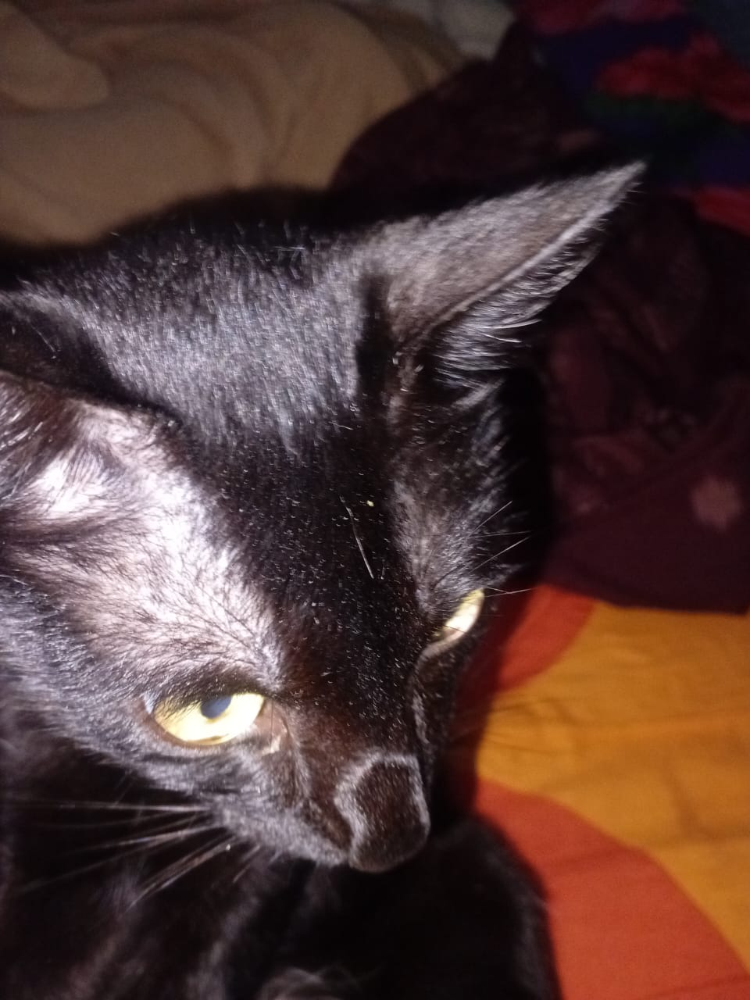
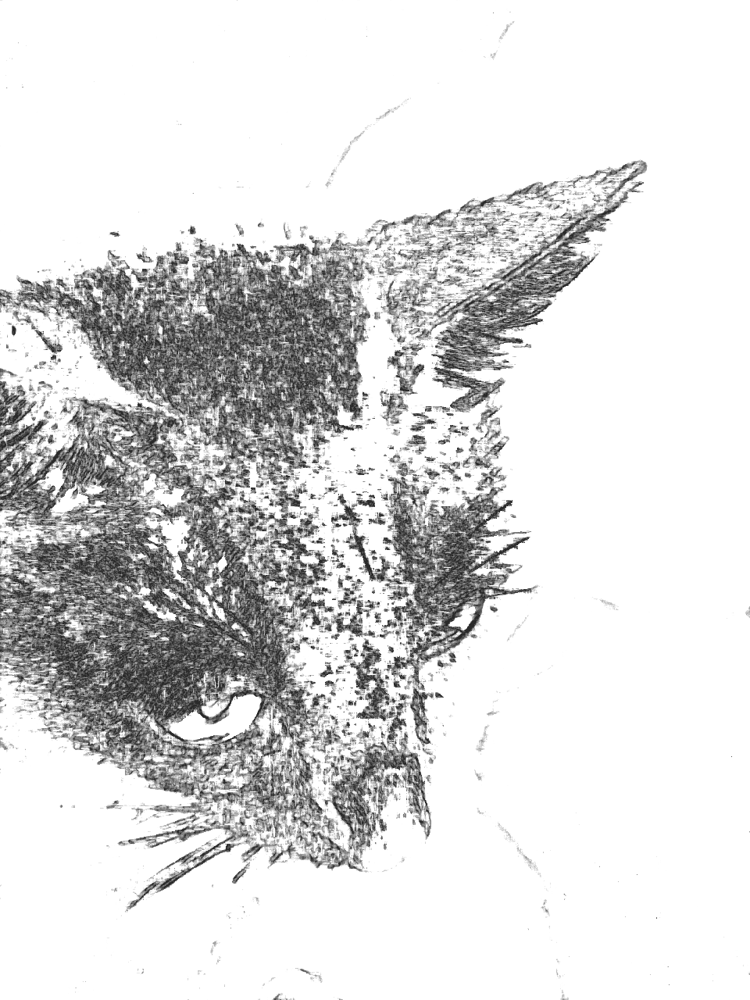
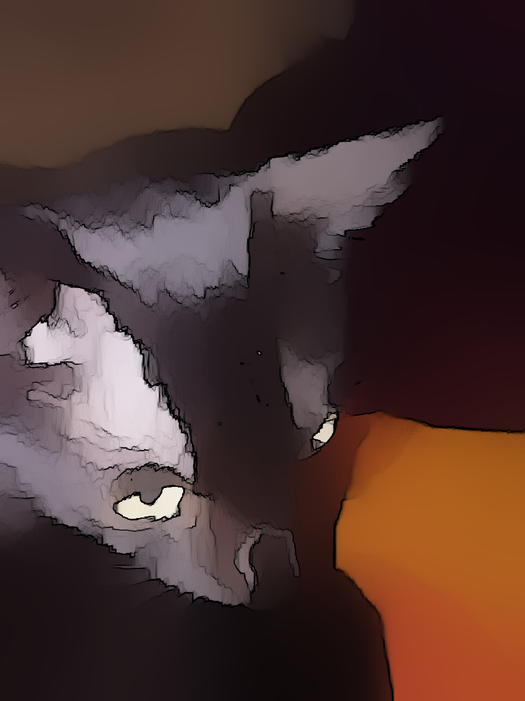

# 🎨 Image to Sketch Conversion Application

This application is used to convert images into **pencil sketches** or **watercolor sketches**.

## 📌 Features

- Upload images (PNG, JPG, JPEG)
- Choose the conversion type: pencil sketch or watercolor sketch
- Display the conversion result
- Download the result

## install

```bash
pip install streamlit
pip install pillow
pip install opencv-python
pip install numpy

## 🛠️ How to Run

```bash
streamlit run app.py

## 📁 Example Images

### Original Image



### Pencil Sketch Result



### Watercolor Sketch Result



## 🛠️ How to Run

```bash
streamlit run app.py
